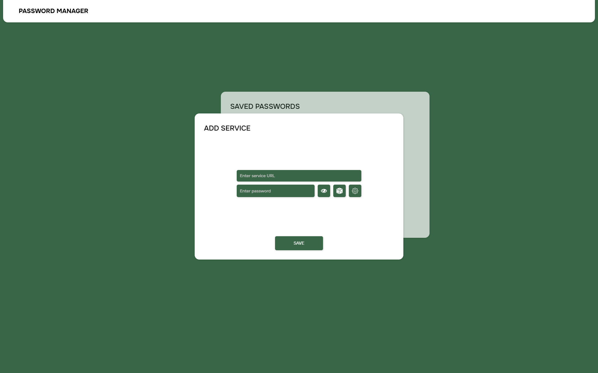

# Password-manager

Password Manager is a demo project designed for password management.
Basic functionality: 

- Generating passwords
- Saving passwords to local storage
- Viewing, copying and deleting saved passwords

There is a 20% chance to simulate a server error during password saving or deletion. This showcases how the app handles errors.

## Preview

## Stack

- Vue.js
- simplebar-vue

## Features

- Password generation: Create passwords with custom parameters (length, special characters, own characters, etc.)
- Adaptive and responsive design for different screen sizes
- Smooth animations and transitions